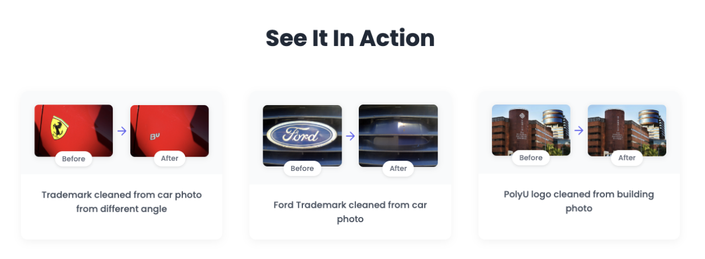
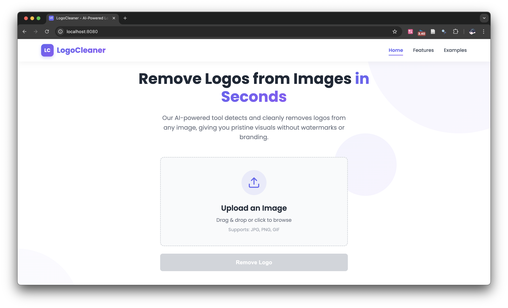
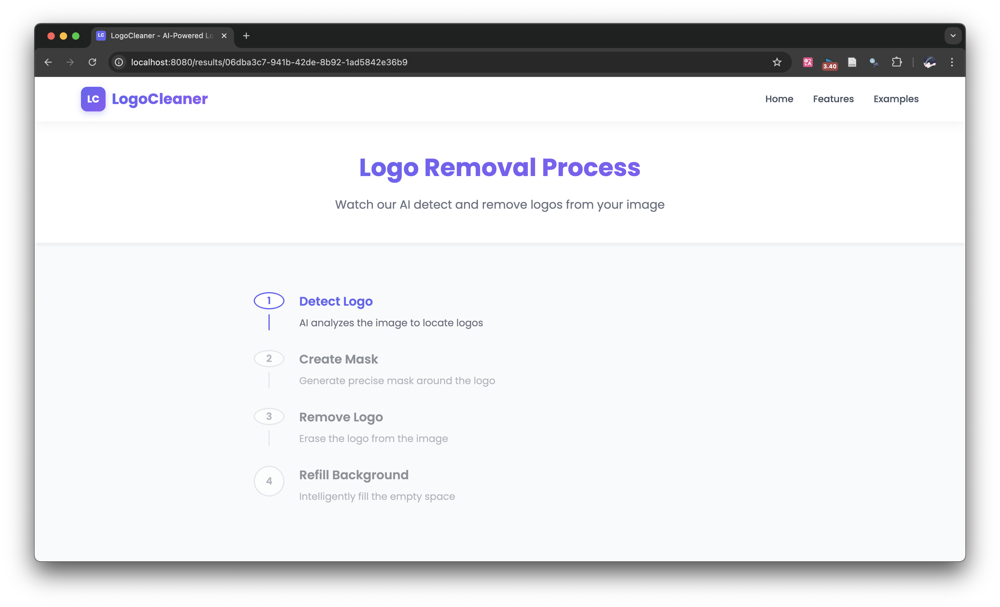
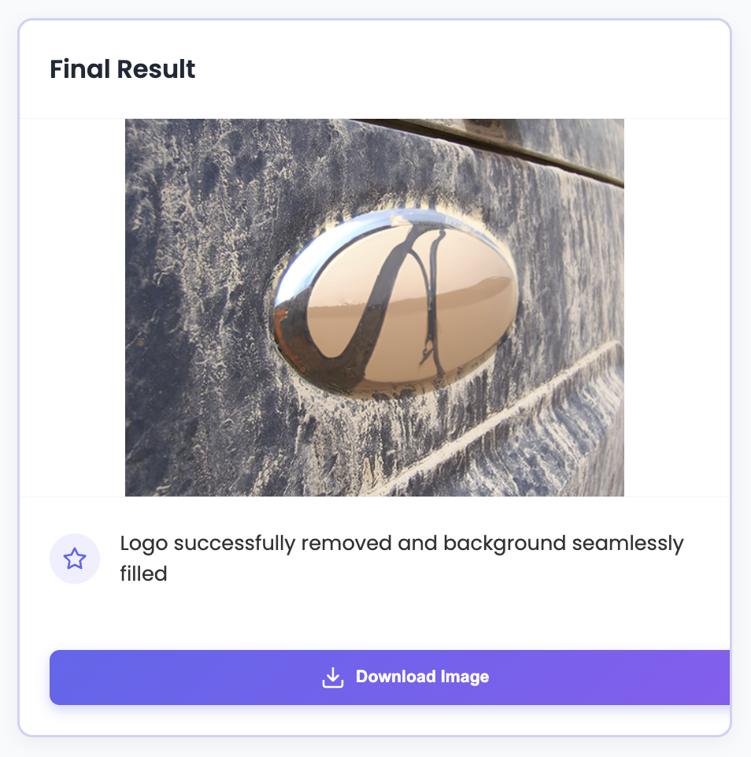
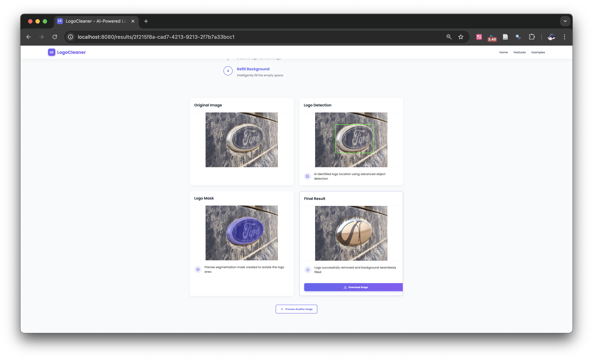

# LogoCleaner - AI-Powered Logo Detection and Removal


**PolyU 2025 Spring COMP4432 Team 24 Course Project**

## Overview

LogoCleaner is an AI-powered tool for detecting and removing logos from images. This repository contains multiple implementations with increasing sophistication, from traditional computer vision methods to state-of-the-art deep learning approaches. The project also includes a complete web application with an intuitive user interface for logo removal.



## Team Info

| Name | Student ID | Responsibility | Contribution |
|------|------------|----------------|--------------|
| DAI Yuhang | 22097845D | Project Management, Model Training v2 | 20% |
| HE Yiyang | 22100143D | Model Training & Implementation v0, Backend API & Integration | 20% |
| YU Pengfei | 22102031D | Report Management & Model Implementation v1 | 20% |
| YAO Yuhao | 22097371D | Slides Design, Illustration Build & Model Implementation v2 | 20% |
| CHEN Fengyuan | 23096069D | Model Training v1 & Frontend Design | 20% |

## Repository Structure

### Quick Navigation

- [Comprehensive Report](./Report.pdf) - Detailed Illustration on the software motivation, model construction and build, full-stack integration and references
- [Demo Web Application](./demo/README.md) - Fully functional logo removal web app running on local machine
- [Implementation v0: SuperPixel + Random Forest](./v0_superpixel_rf/README.md) - Traditional computer vision approach
- [Implementation v1: U-Net Architecture](./v1_unet/README.md) - Well-known Deep learning semantic segmentation baseline: Unet
- [Implementation v2: SAM + Neural Networks](./v2_sam_nn/README.md) - State-of-the-art ViT approach on segmentation and our refinement on logo detection

## Assessment Points

### Innovation

Our project tackles the practical problem of unwanted logos in images (copyright issues, visual distraction) with a novel approach:

- **Innovative Problem**: While logo detection exists, automatic removal with natural background filling is relatively unexplored
- **Progression of Solutions**: We demonstrate three increasingly sophisticated approaches:
  - Traditional computer vision with SuperPixel segmentation and Random Forest classification
  - Deep learning with U-Net for pixel-level segmentation
  - State-of-the-art ViT approach combining SAM (Segment Anything Model) with neural networks for precise logo detection and natural removal
- Unlike many existing solutions that simply blur or cover logos, our system removes them entirely and intelligently fills the background for a natural result.

### User Experience

The LogoCleaner system provides several benefits:

- **Easy-to-Use Interface**: Upload an image → Click "Remove Logo" → Download result
- **Step-by-Step Visualization**: Users can see the entire process (detection, masking, removal, inpainting)
- **Fast Processing**: Optimized pipeline for quick results each images requires around 5 seconds to detect logo and 15 seconds wait for OpenAI inpainting the removed logo region
- **Intuitive Web Interface**: Modern, responsive design with clear feedback

Our web application makes advanced AI technology accessible to users without technical knowledge. The demo showcases real-world examples of logo removal from various images.

### Technical Level

This project demonstrates several advanced technical skills:

- **Multiple Implementation Approaches**:
  - Traditional computer vision techniques (SuperPixel, Random Forest)
  - Deep learning for semantic segmentation (U-Net)
  - Advanced segmentation with SAM and custom neural networks
- **Full-Stack Development**:
  - Backend: Python, Flask, PyTorch
  - Frontend: Vue.js, JavaScript
  - RESTful API design
- **Infrastructure Integration**:
  - Weights & Biases for experiment tracking
  - Model deployment and serving

The codebase is well-structured, documented, and follows best practices for each technology used.

### Soundness

We thoroughly evaluated each implementation:

- **Performance Metrics**:
  - Logo detection accuracy (in test set have an avg: dice loss around 0.29)
  - Quality of removal (visual fidelity - see our demo)
  - Processing time (5 seconds detection and 15 seconds OpenAI API inpainting)
- **Limitations**:
  - v0: Limited accuracy with complex logos
  - v1: Requires significant GPU resources
  - v2: Dependency on pre-trained models
- **Future Work**:
  - Improved background inpainting
  - Support for video processing via SAM 2.0
  - Reduced model size for better deployment

## Demo Web Application

The demo folder contains a complete web application for LogoCleaner:

- **Frontend**: Vue.js application with intuitive UI
- **Backend**: Flask API for image processing and logo removal
- **Features**: Image upload, logo detection, removal, and download

### Demo Walkthrough

1. **Upload Image**: Drag and drop or select an image containing a logo
   

2. **Detection Phase**: The system automatically detects logos in the image
   

3. **Removal Process**: Watch as the logo is removed and background is inpainted
   

4. **Final Result**: Download or share the logo-free image
   

### Running the Demo

For detailed instructions, see:

- [Running the LogoCleaner Application](./User_Manual.pdf)
- [Main Demo Documentation](./demo/README.md)

### Model for Demo

For the demo application, download the model from:

- Model link: [LogoCleaner Model on HuggingFace](https://huggingface.co/PeterDAI/LogoCleaner/tree/main)
- Place the downloaded model in the backend directory.


## Technical Implementations

### Training Data

The selector module was trained on [FlickrLogos-32](https://www.uni-augsburg.de/en/fakultaet/fai/informatik/prof/mmc/research/datensatze/flickrlogos/) dataset released in ICMR11 and updated in ICML2017, which contains photos showing brand logos and is meant for the evaluation of logo retrieval and multi-class logo detection/recognition systems on real-world images.

Note that even though the dataset is open-source and well-known, we cannot provide the dataset with link since the owner requires an (informal) email to [email](request_flickrlogos@informatik.uni-augsburg.de) in order to get the dataset. Our team also send the email and get the original datasets and we apologize for the inconvience.

### v0: SuperPixel + Random Forest

Our baseline approach uses traditional computer vision techniques:

- SuperPixel segmentation to divide images into meaningful regions
- Random Forest classifier to identify logo regions
- Basic inpainting for removal

[Read more about the SuperPixel + RF approach Setup](./v0_superpixel_rf/README.md)

### v1: U-Net Architecture

Our second approach leverages deep learning for more accurate segmentation:

- U-Net architecture for pixel-level logo segmentation
- Custom loss functions (1.0 * dice loss + 0.5 * bce loss + 0.5 * focal loss) for imbalanced data
- Training pipeline with data augmentation

[Read more about the U-Net approach Setup](./v1_unet/README.md)

### v2: SAM + Neural Networks

Our most advanced approach combines state-of-the-art models:

- Facebook's Segment Anything Model (SAM) (base version ~ 375MB) for high-quality segmentation
- Custom neural network for logo classification after SAM (self-trained ~ 117MB)
- Advanced inpainting for seamless logo removal (OpenAI Image Editing with Dall-E 2)

[Read more about the SAM + NN approach Setup](./v2_sam_nn/README.md)

### Training Procedure

We use a single RTX 4090 graphic card and train with 50 epoches (the selector module converges very fast at around the 45 epoch). You could refer to the training source code with our [GitHub Repository](https://github.com/hiteacherIamhumble/LogoCleaner).

### Evaluation Results

We choose the classic fusion loss (BCE and Dice loss) for the evaluation results and outperforms the classic Unet with 2% dice loss. The details please refer to the report in our [GitHub Repository](https://github.com/hiteacherIamhumble/LogoCleaner).

### Download the Models used in Demo

### Direct Download
  - Model link: [LogoCleaner Model on HuggingFace](https://huggingface.co/PeterDAI/LogoCleaner/tree/main)
  - Place the downloaded model in the current directory.

### Using the Hugging Face Hub

  ```python
  from huggingface_hub import hf_hub_download

  # Download the SAM model
  sam_path = hf_hub_download(
      repo_id="PeterDAI/LogoCleaner",
      filename="sam_vit_b_01ec64.pth"
  )

  # Download the selector model
  selector_path = hf_hub_download(
      repo_id="PeterDAI/LogoCleaner",
      filename="best_model.pth"
  )
  ```
## Features

- **Logo Detection**: Automatically identifies logos in images using AI
- **Logo Removal**: Removes detected logos with intelligent background filling
- **Multiple Approaches**: Choose between different implementation methods
- **Web Application**: Easy-to-use interface for non-technical users
- **Step-by-Step Visualization**: See the entire logo removal process

## Screenshots

### Main Interface


### Logo Detection Process


### Before and After Comparison


## Installation

### Prerequisites

- Python 3.8+
- Node.js 14+
- npm 6+
- CUDA-compatible GPU (recommended for v1 and v2, no need for demo or v0)

### Setup

1. Clone the repository
```bash
git clone https://github.com/hiteacherIamhumble/LogoCleaner.git
cd LogoCleaner
```

2. Set up a virtual environment
```bash
conda create -n logocleaner python=3.10
conda activate logocleaner
```

3. Follow each subfolder README.md for details

4. Datasets
  - According to the owner of the dataset, you have to email and download the datasets your self

## Usage

1. Start the backend server
```bash
cd demo/backend
pip install -r requirements.txt
python app.py
```

2. Start the frontend application
```bash
cd demo/frontend
npm install
npm run dev
```

3. Open your browser and navigate to `http://localhost:8080`

4. Upload an image, adjust settings if needed, and click "Remove Logo"


## Contributing

We welcome contributions to LogoCleaner! Please follow these steps:

1. Fork the repository
2. Create a feature branch (`git checkout -b feature/amazing-feature`)
3. Commit your changes (`git commit -m 'Add some amazing feature'`)
4. Push to the branch (`git push origin feature/amazing-feature`)
5. Open a Pull Request

For major changes, please open an issue first to discuss what you would like to change.

## Acknowledgments

- [Segment Anything Model (SAM)](https://segment-anything.com/) by Meta Research
- [PyTorch](https://pytorch.org/) for deep learning implementation
- [scikit-learn](https://scikit-learn.org/) for traditional ML approaches
- [Vue.js](https://vuejs.org/) for frontend development
- [Flask](https://flask.palletsprojects.com/) for the backend API
- [Weights & Biases](https://wandb.ai/) for experiment tracking

## License

This project is licensed under the MIT License - see the [LICENSE](./LICENSE) file for details.